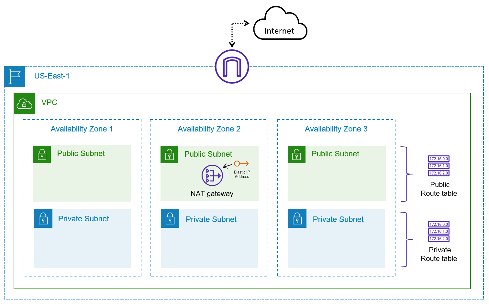

# Basic VPC

## Overview

Terraform configuration for a basic VPC including both public and private subnets that span multiple Availability Zones.
You expect to host Internet-facing applications. Additionally, you have other applications that need to access the Internet to retrieve security and operating system updates.

- Creates a new VPC in your account in the AP-SOUTHEAST-2 region.
- Creates public and private subnets in three different Availability Zones.
- Deploys an Internet Gateway and attach it to the VPC.
- Provisions a NAT Gateway for outbound connectivity from private subnets (only one instance is used for cost saving purposes).

## Diagram

 

## Deployment

### Ensure code is formatted correctly
This command auto-formats Terraform files to ensure consistent style across your configuration files.
```
terraform fmt
```

### Validate changes are syntactically correct
This command checks whether the Terraform configuration files are syntactically valid and internally consistent.
```
terraform validate
```

### Create a plan to preview changes to state
This command shows a preview of the changes that Terraform will apply, helping you verify what will be modified before actually deploying the changes.
```
terraform plan
```

### Deploy changes and update state
This command applies the planned changes and automatically approves any required actions. It updates the Terraform state to reflect the new infrastructure.
```
terraform apply -auto-approve
```

### List resources managed by terraform
This command lists all the resources that Terraform is currently managing.
```
terraform state list
```
### Delete resources managed by terraform
This command destroys all the resources managed by Terraform, and automatically approves the action.
```
terraform destroy -auto-approve
```